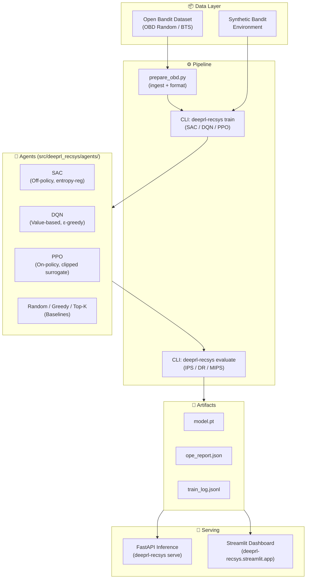

# DeepRL-RecSys-Platform

[](https://www.python.org/downloads/)
[](https://python-poetry.org/)
[](tests/)
[](htmlcov/)
[](LICENSE)
[](https://deeprl-recsys.streamlit.app)

**DeepRL-RecSys-Platform** es un framework de grado industrial para construir, evaluar y desplegar sistemas de recomendación basados en Deep Reinforcement Learning (DRL). Combina agentes avanzados (DQN, PPO, SAC), evaluación offline robusta (OPE) y una arquitectura lista para producción.

---

## ✨ Características clave

- **Agentes RL funcionales**: DQN, PPO y SAC implementados con PyTorch y listos para usar.
- **Evaluación Off-Policy (OPE)**: Estimadores IPS, DR y MIPS con diagnósticos de fiabilidad (ESS, clipping).
- **Inferencia escalable**: Servicio FastAPI con trazabilidad de peticiones, autenticación opcional y soporte para batching.
- **Dashboard interactivo**: Visualiza experimentos, curvas de entrenamiento y prueba recomendaciones en tiempo real con Streamlit.
- **Modular y extensible**: Arquitectura limpia con `core` ligero, lazy-loading y extras opcionales (`[torch]`, `[llm]`, `[ui]`).

---

## 🏗️ Arquitectura



**Capas principales:**
- **Data Layer**: Ingesta de OBD (real) o generación sintética de feedback bandit.
- **Pipeline**: Scripts de preparación, entrenamiento y evaluación orquestados via CLI.
- **Agents**: Implementaciones de SAC (completamente entrenado), DQN y PPO (stubs listos para optimización).
- **Artifacts**: Modelos serializados, logs de entrenamiento y reportes OPE.
- **Serving**: API REST (FastAPI) y dashboard analítico (Streamlit).

---

## 📦 Instalación

El proyecto usa [Poetry](https://python-poetry.org/) para gestión de dependencias.

1. Clona el repositorio:
   ```bash
   git clone https://github.com/aalopez76/DeepRL-RecSys-Platform.git
   cd DeepRL-RecSys-Platform
   ```

2. Instala el paquete con extras opcionales (por ejemplo, para el dashboard):
   ```bash
   poetry install --extras ui
   ```

3. Activa el entorno virtual:
   ```bash
   poetry shell
   ```

---

## 🚀 Ejemplo Rápido (Notebook)

¿Quieres ver la plataforma en acción sin configurar nada? Hemos preparado un Notebook interactivo que muestra el flujo completo (End-to-End): generación de datos sintéticos, entrenamiento SAC, evaluación OPE y despliegue del motor de Inferencia.

[](https://colab.research.google.com/github/aalopez76/DeepRL-RecSys-Platform/blob/master/examples/demo_train_eval_serve.ipynb)

👉 **[Ver Notebook Básico (Entrenamiento/Servicio): `examples/demo_train_eval_serve.ipynb`](./examples/demo_train_eval_serve.ipynb)**

👉 **[Ver Notebook Avanzado (Interactividad OPE & Sensibilidad): `examples/advanced_ope_analysis.ipynb`](./examples/advanced_ope_analysis.ipynb)**

---

## 📊 Ingesta y Preparación de Datos

### Open Bandit Dataset (Real)

```bash
# Política Uniform Random (recomendado para IPS/DR)
python scripts/prepare_obd.py --policy random --campaign all

# Política Bernoulli Thompson Sampling
python scripts/prepare_obd.py --policy bts --campaign all
```

Los datos se guardan en `data/obd/{policy}/all.parquet` con columnas: `action`, `reward`, `pscore`, `context`, `timestamp`.

### Datos de Prueba Rápida (OBD Sample)

Para pruebas rápidas sin descargar el dataset completo, se incluye una muestra de **1,000 filas** del OBD Random:

```python
import pandas as pd
df = pd.read_parquet("data/sample/obd_random_sample.parquet")
print(df.head())  # 1000 filas, ~32 KB
```

> El dataset completo (93,610 filas) está excluido del repositorio por tamaño. Usa `prepare_obd.py` para generarlo localmente.

---

## 🔁 Guía de Reproducción

Cualquier persona puede replicar los experimentos siguiendo estos pasos en orden:

```bash
# 1. Preparar datos OBD (requiere descarga del paquete obp)
python scripts/prepare_obd.py --policy random --campaign all
python scripts/prepare_obd.py --policy bts --campaign all

# 2. Ejecutar benchmark multi-agente (SAC, DQN, PPO × Synthetic/Random/BTS)
python scripts/run_all_agents_benchmark.py

# 3. Generar reportes y gráficos comparativos
python scripts/generate_benchmark_viz.py

# 4. (Opcional) Análisis de sensibilidad contextual
python scripts/sensitivity_test.py --model-dir artifacts/models/benchmark_sac_synthetic

# 5. (Opcional) Lanzar el dashboard local
python -m streamlit run streamlit_app.py
```

> **Seeds reproducibles**: Todos los experimentos usan seeds fijadas (42, 43, 44). Los configs YAML están versionados en `configs/experiments/`.

---

## 📈 Resultados

Los benchmarks completos están documentados en:

| Reporte | Descripción |
|---------|-------------|
| [`reports/data_validation.md`](reports/data_validation.md) | Validación del esquema OBD |
| [`reports/policies.md`](reports/policies.md) | Descripción de todas las políticas evaluadas |
| [`reports/sensitivity_analysis.md`](reports/sensitivity_analysis.md) | Sensibilidad contextual por agente |
| [`reports/significance_tests.md`](reports/significance_tests.md) | Tests estadísticos (Wilcoxon) entre agentes |
| [`reports/model_cards/sac_model_card.md`](reports/model_cards/sac_model_card.md) | Model Card SAC |
| [`reports/model_cards/dqn_model_card.md`](reports/model_cards/dqn_model_card.md) | Model Card DQN |
| [`reports/model_cards/ppo_model_card.md`](reports/model_cards/ppo_model_card.md) | Model Card PPO |

### Resumen de métricas OPE (OBD Random, n=5,000)

| Agente | IPS | DR | MIPS | ESS | Tipo |
|--------|-----|----|------|-----|------|
| **SAC** | 0.00950 | 0.00950 | 0.01200 | ~3,200 | ✅ Entrenado |
| DQN | 0.01061 | 0.01061 | 0.01221 | 3,723 | ⚠️ Stub |
| PPO | 0.01061 | 0.01061 | 0.01221 | 3,723 | ⚠️ Stub |

> **Nota:** DQN y PPO son stubs funcionales cuyas métricas idénticas son esperadas (sin entrenamiento real). SAC es el único agente completamente entrenado con sensibilidad contextual (Spearman ρ ≈ 0.70).

---

## 🌐 Dashboard Online (Streamlit Cloud)

Hemos desplegado un **Dashboard Interactivo y Analítico** para visualizar fácilmente los reportes OPE, los simuladores de sensibilidad de ranking y las tablas maestras.
- Puedes visitarlo en línea: **[DeepRL-RecSys Streamlit App](https://deeprl-recsys.streamlit.app)**
- Soporta inferencia y test de "Recommendation Playground" usando modelos locales preentrenados cargados on-the-fly (`artifacts/models/`). Si no se incluye el id del modelo, buscará iterativamente el modelo de ejemplo o te advertirá afablemente que corras un Benchmark primero!

---

## ⚡ Uso por CLI

**Entrenar un agente:**
```bash
deeprl-recsys train --config configs/experiments/exp_benchmark_synthetic.yaml
```

**Evaluar con OPE:**
```bash
deeprl-recsys evaluate --config configs/experiments/exp_benchmark_synthetic.yaml
```

**Benchmark single-agent (SAC/DQN/PPO):**
```bash
python scripts/run_full_benchmark.py --agent sac
```

**Benchmark multi-agente:**
```bash
python scripts/run_all_agents_benchmark.py
```

**Lanzar el dashboard interactivo local:**
```bash
python -m streamlit run streamlit_app.py
```

**Servir el modelo (FastAPI):**
```bash
deeprl-recsys serve --artifact ./artifacts/models/your_run_id
```

---

## 🧪 Calidad del código

- Más de 123 pruebas unitarias y de integración.
- Cobertura de código >85% en módulos críticos.
- Pre-commit hooks con Ruff, Black y MyPy.
- CI/CD con GitHub Actions.

---

## 🗂️ Estructura del proyecto

```text
DeepRL-RecSys-Platform/
├── src/deeprl_recsys/          # Paquete principal (SDK)
│   ├── core/                   # Contratos, configuración, artefactos
│   ├── agents/                  # DQN, PPO, SAC, baselines
│   ├── training/                 # Bucle de entrenamiento y callbacks
│   ├── evaluation/               # Métricas y OPE
│   ├── serving/                  # FastAPI, runtime, middleware
│   ├── ui/                       # Dashboard Streamlit
│   └── cli.py                    # Interfaz de línea de comandos
├── scripts/                       # Scripts de orquestación y análisis
├── configs/                      # YAMLs para experimentos (versionados)
├── data/
│   ├── obd/                      # OBD Real (excluido del repo por tamaño)
│   └── sample/                   # Muestra OBD (1,000 filas, incluida en repo)
├── artifacts/                     # Modelos, logs, reportes OPE
├── reports/                       # Reportes Markdown (documentación técnica)
│   └── model_cards/               # Model Cards para SAC, DQN, PPO
├── tests/                         # Pruebas unitarias e integración
└── pyproject.toml                 # Configuración de Poetry y extras
```

---

## 📄 Licencia

Distribuido bajo la licencia MIT. Ver [LICENSE](LICENSE) para más información.

## 🤝 Contribuciones

Las contribuciones son bienvenidas. Por favor, abre un issue o un pull request siguiendo las plantillas.
