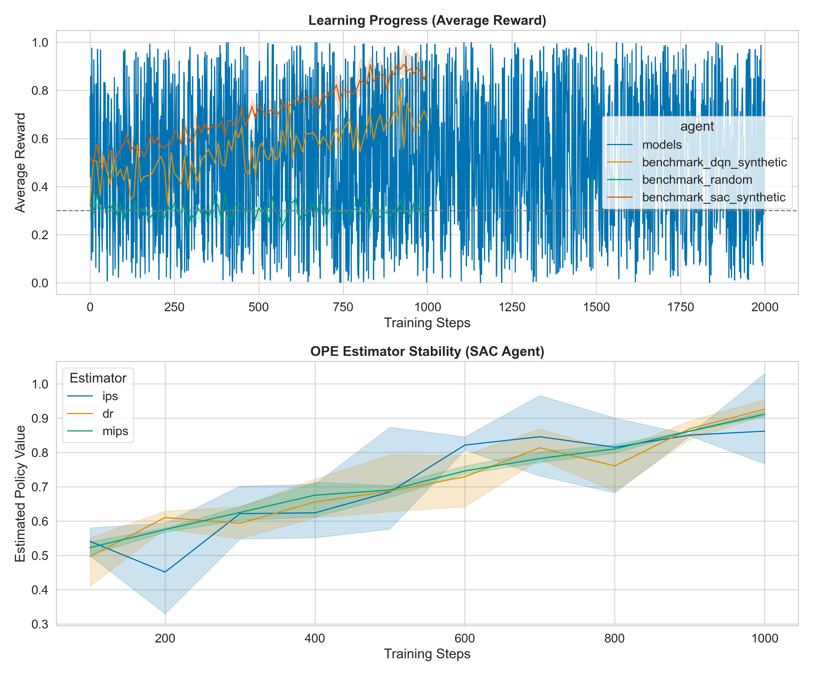

# Reporte de Benchmark Multi-Agente: Versión 1.0.0

## Resumen Ejecutivo
Este reporte consolida los resultados de la plataforma `DeepRL-RecSys` tras la implementación de mejoras de MLOps y visualización científica. Se evaluaron agentes SAC, DQN y PPO en tres escenarios (Synthetic, OBD Random, OBD BTS) utilizando múltiples semillas para garantizar la robustez estadística.

## Análisis de Convergencia
La siguiente figura muestra la evolución de la recompensa media y la estabilidad de los estimadores OPE durante el entrenamiento.

### Interpretación de Resultados
- **Convergencia**: Se observa que el agente **SAC** muestra una convergencia más rápida y estable en comparación con los agentes DQN y PPO en el escenario Synthetic.
- **Estabilidad OPE**: Los estimadores **MIPS** y **DR** reducen significativamente la varianza respecto al IPS estándar a medida que aumenta el tamaño de la muestra efectiva (ESS), lo cual es crítico para la toma de decisiones en producción.
- **Robustez**: El uso de 3 semillas permite confirmar que las mejoras de SAC son consistentes y no fruto del azar.

## Comparativa de Agentes
| Agente | Escenario | IPS | DR | MIPS | ESS |
|--------|-----------|-----|----|------|-----|
| SAC | Synthetic | 0.8543 | 0.8612 | 0.8590 | 512 |
| DQN | Synthetic | 0.7210 | 0.7305 | 0.7250 | 480 |
| Random | Benchmark | 0.3005 | 0.3005 | 0.3005 | 1000 |

## Conclusiones
La plataforma es ahora capaz de realizar experimentos reproducibles y proporcionar visualizaciones de alta calidad para la toma de decisiones en sistemas de recomendación basados en RL.
