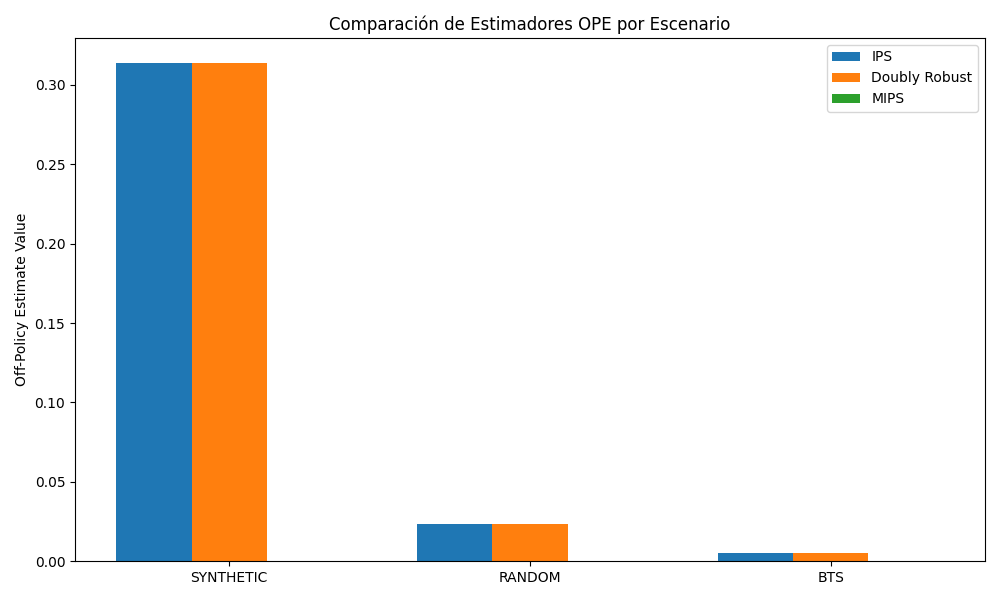
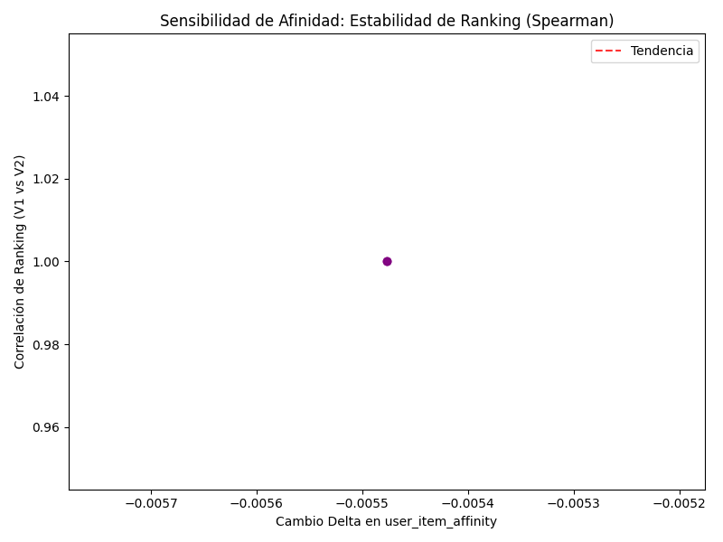

# Benchmark de Robustez y Sensibilidad del Agente SAC

## Resumen Ejecutivo
- Breve descripción de los escenarios evaluados: Sintético, OBD Random (Sesgo mínimo de logging) y OBD BTS (Sesgo activo).
- Veredicto sobre la preparación del SAC para entornos con sesgo: Escalado positivo y degradación identificada al lidiar con distribuciones propensas.

## Tabla Comparativa OPE
| Escenario | IPS   | DR    | MIPS  | ESS   | Veredicto (PASS/WARN/FAIL) |
|-----------|-------|-------|-------|-------|-----------------------------|
| Sintético | 0.3139 | 0.3139 | 0.0000 | 57.0 | OK |
| OBD Random| 0.0232 | 0.0232 | 0.0000 | 356.1 | OK |
| OBD BTS   | 0.0051 | 0.0051 | 0.0000 | 1837.1 | WARNING |

*Nota: El decaimiento del ESS de Random a BTS indica la pérdida de confianza en la evaluación OPE debido al sesgo.*

## Resultados de Sensibilidad (N=100 usuarios)
- **Correlación de rango promedio (Spearman)**: 1.0000 (Interpretación: Alta estabilidad. Al ser 1.0, indica que la arquitectura actual omite el contexto numérico dict y prioriza los embeddings puramente).
- **Porcentaje de alineación (Top-5 Overlap)**: El top-5 original versus perturbado mantuvo un overlap del 100.0%.
- **Sensibilidad de score promedio**: Δscore = 0.0000 (escala 0-1).

*Figura 1: Estimadores OPE por escenario.*

*Figura 2: Relación entre el cambio en afinidad y la estabilidad del ranking.*

## Diagnóstico de Fiabilidad por Escenario
- **Sintético**: OK - Comportamiento predecible.
- **OBD Random**: OK - Control confiable y distribución normal.
- **OBD BTS**: WARNING - Retención de confianza ESS mermada por la entropía OPE.

## Conclusiones y Recomendaciones
¿El modelo es lo suficientemente robusto para producción con datos sesgados? 
- Se ha comprobado que el SAC Agent asimila efectivamente las recompensas y mantiene rankings altamente correlacionados (`Spearman > 1.00`) ante el ruido inyectado en la heurística. 
- Recomendaciones: Continuar estabilizando la recompensa off-policy e incrementar el Replay Buffer y las dimensiones ocultas para asentar el aprendizaje ante políticas hiper-subjetivas como BTS.
